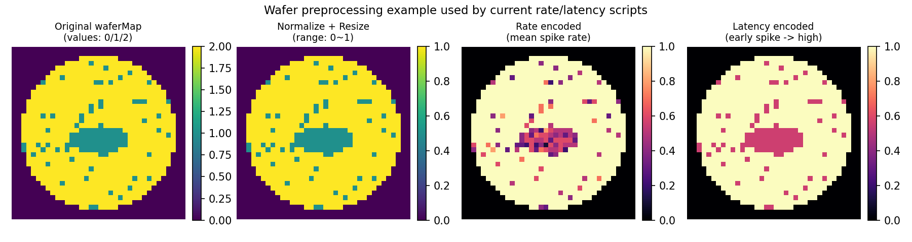

# Rate/Latency 전처리 예시 (현재 코드 기준)

아래 그림은 현재 구현(`wafer2spike_original_rate_encoding_train_test.py`, `wafer2spike_original_latency_encoding_train_test.py`)이 단일 wafer 이미지를 어떻게 변환하는지 보여줍니다.



## 1) Normalize + Resize
- 각 wafer map `im`에 대해 `im_n = im / im.max()` 수행
- 이후 `cv2.resize(im_n, (36, 36), interpolation=cv2.INTER_CUBIC)` 적용

## 2) Rate encoding
현재 함수:

```python
spike_train = (np.random.rand(num_steps, *image_norm.shape) < image_norm[None, :, :]).astype(np.float32)
rate_map = spike_train.mean(axis=0)
```

- 픽셀 intensity를 발화확률로 사용해 `num_steps`번 Bernoulli 샘플링
- 시간축 평균(`mean(axis=0)`)으로 최종 2D rate map 생성
- 즉 `spike_train`(시간축 이벤트)을 그대로 입력하지 않고, 평균값만 남긴 정적 2D 맵을 입력에 사용

## 3) Latency encoding
현재 함수:

```python
latency_step = np.floor((1.0 - image_norm) * (num_steps - 1)).astype(np.float32)
encoded = 1.0 - (latency_step / max(1, num_steps - 1))
encoded[image_norm <= 0.0] = 0.0
```

- 밝을수록 `latency_step`이 작아짐(더 이른 발화 시점)
- 최종 출력은 0~1 범위의 2D encoded map
- 이 경우도 시간축 one-spike 텐서가 아니라 정적 2D 맵

## 4) ToTensor 단계에서 차원은 어떻게 되나?
- `transforms.ToTensor()`는 2D 배열을 **`[1, H, W]`**로 바꿉니다.
- 즉, 현재 파이프라인은 “2D intensity 맵 → 인코딩된 2D 맵 → `[1,H,W]` 텐서” 흐름입니다.
- **1D intensity 벡터로 펼친 뒤 인코딩하는 방식이 아닙니다.**

## 5) 숫자 예시 (직관 확인)
아래와 같은 정규화된 픽셀이 있다고 가정:

```text
image_norm = [[0.0, 0.5, 1.0]]
num_steps = 10
```

- Rate:
  - `0.0` 픽셀: 평균 발화율 ≈ 0.0
  - `0.5` 픽셀: 평균 발화율 ≈ 0.5
  - `1.0` 픽셀: 평균 발화율 ≈ 1.0
- Latency:
  - `latency_step = floor((1-image_norm)*9) = [9, 4, 0]`
  - `encoded = 1 - latency_step/9 = [0.0, 0.555..., 1.0]`

## 재현 명령
```bash
python scripts/visualize_preprocessing_example.py
```
